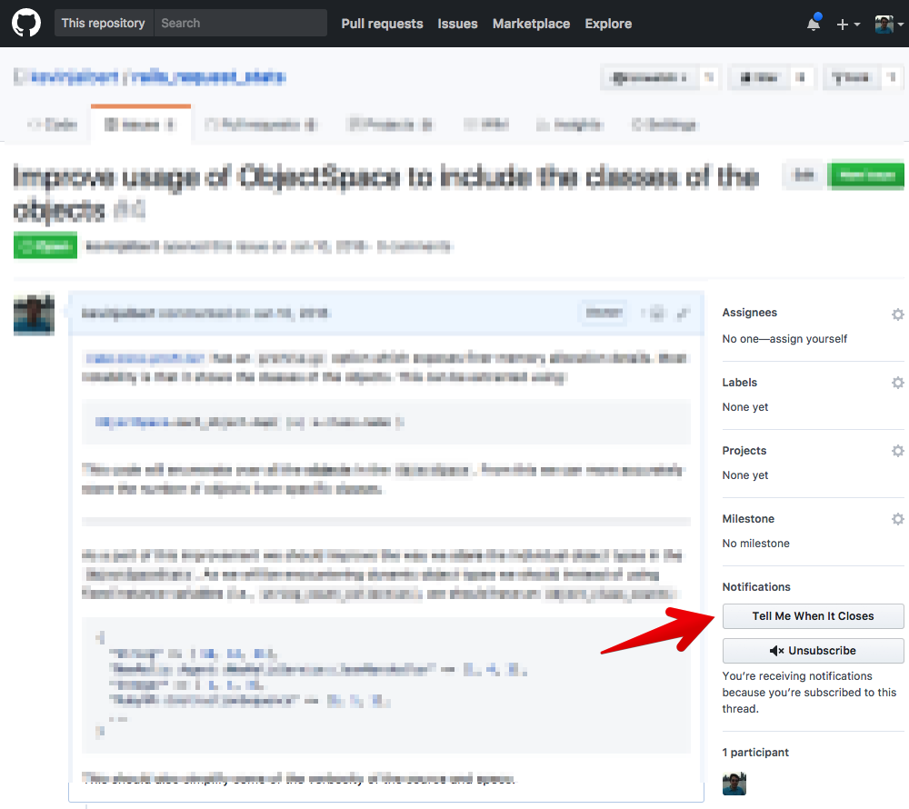

  <h1>
    GitHub: Tell Me When It Closes
  </h1>

  

    <strong>Add <a href=https://tellmewhenitcloses.com>tellmewhenitcloses.com</a> button to GitHub issues and pull requests.</strong>
  

  

# Extension Install Links

* [Chrome](https://chrome.google.com/webstore/detail/github-tell-me-when-it-cl/mfaeeelmjfbblmkbalffbhfpkhhnjalp)
* [Firefox](https://addons.mozilla.org/en-US/firefox/addon/github-tell-me-when-it-closes/)
* [Opera](https://addons.opera.com/en/extensions/details/github-tell-me-when-it-closes)

# Features

Add tellmewhenitcloses.com button to GitHub issues and pull requests.

Now you don't have to manually open the website and paste in the URL.

# Development

## Installation
1. Clone the repository `git clone git@github.com:kevinjalbert/github-tell-me-when-it-closes-extension.git`
2. Run `yarn install`
3. Run `yarn run build`

##### Load the extension in Chrome & Opera
1. Open Chrome/Opera browser and navigate to chrome://extensions
2. Select "Developer Mode" and then click "Load unpacked extension..."
3. From the file browser, choose to `github-tell-me-when-it-closes-extension/build/chrome` or (`github-tell-me-when-it-closes-extension/build/opera`)

##### Load the extension in Firefox
1. Open Firefox browser and navigate to about:debugging
2. Click "Load Temporary Add-on" and from the file browser, choose `github-tell-me-when-it-closes-extension/build/firefox`

## Developing
The following tasks can be used when you want to start developing the extension and want to enable live reload:

- `yarn run chrome-watch`
- `yarn run opera-watch`
- `yarn run firefox-watch`

## Packaging
Run `yarn run dist` to create a zipped, production-ready extension for each browser.
